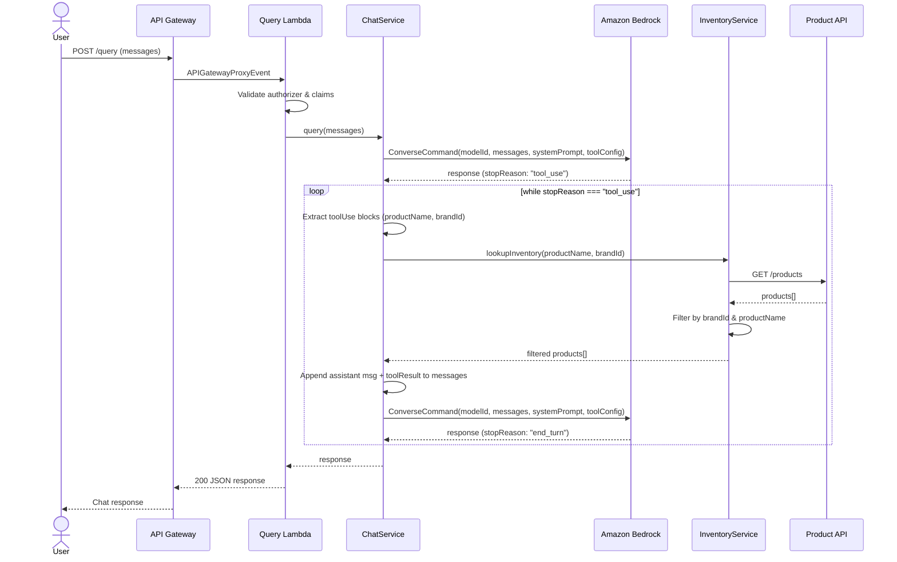

# Query with Bedrock Tool Use — Sequence Diagram

```mermaid
sequenceDiagram
    actor User
    participant APIGW as API Gateway
    participant Lambda as Query Lambda
    participant ChatSvc as ChatService
    participant Bedrock as Amazon Bedrock
    participant InvSvc as InventoryService
    participant ProductAPI as Product API

    User->>APIGW: POST /query (messages)
    APIGW->>Lambda: APIGatewayProxyEvent
    Lambda->>Lambda: Validate authorizer & claims
    Lambda->>ChatSvc: query(messages)

    ChatSvc->>Bedrock: ConverseCommand(modelId, messages, systemPrompt, toolConfig)
    Bedrock-->>ChatSvc: response (stopReason: "tool_use")

    loop while stopReason === "tool_use"
        ChatSvc->>ChatSvc: Extract toolUse blocks (productName, brandId)
        ChatSvc->>InvSvc: lookupInventory(productName, brandId)
        InvSvc->>ProductAPI: GET /products
        ProductAPI-->>InvSvc: products[]
        InvSvc->>InvSvc: Filter by brandId & productName
        InvSvc-->>ChatSvc: filtered products[]
        ChatSvc->>ChatSvc: Append assistant msg + toolResult to messages
        ChatSvc->>Bedrock: ConverseCommand(modelId, messages, systemPrompt, toolConfig)
        Bedrock-->>ChatSvc: response (stopReason: "end_turn")
    end

    ChatSvc-->>Lambda: response
    Lambda-->>APIGW: 200 JSON response
    APIGW-->>User: Chat response
```
